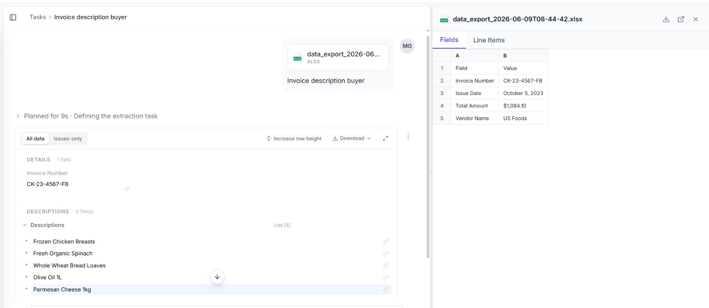

# AI-Powered Invoice Processing Automation via Nanonets Agents

This repository demonstrates an end-to-end Intelligent Document Processing (IDP) workflow that completely automates Accounts Payable data entry. Using **Nanonets AI Agents**, the pipeline instantly ingests incoming multi-format invoice PDFs, extracts high-value transactional fields (Invoice Number, Date, Vendor Name, and Total Amount) without layout templates, and logs the structured outputs straight into a Google Sheets centralized tracker.

## 🚀 Key Features & Scalability
* **Template-Free Extraction**: Leveraging deep learning and computer vision to read complex layouts, distinct regional tax layers (e.g., GST 12% vs 28%), and different currencies automatically.
* **Hands-Free Ingestion**: Triggers instantly upon receiving forward emails containing invoices.
* **Batch Processing Engine**: Processes 10 to 10,000+ files concurrently in the cloud without system bottlenecks.
* **Audit Trail Integration**: Every document transaction is registered with a designated Task ID and exact execution timestamps for bulletproof compliance.

---

## 🛠️ Step-by-Step Workflow Blueprint

The process moves through ingestion, AI modeling, and cloud exporting stages as shown in the system configuration maps below:

### 1. Connecting System Data Integrations

*Configuring secure storage write permissions under the Nanonets environment.*

### 2. Instructing the AI Extract Agent

*Defining plain-English guidelines for your document parser (e.g., "Extract Invoice Number, Date, Vendor Name, and Total Amount").*

---

## 📊 Automated Production Results

Once an invoice batch is forwarded to your active agent email channel, the data validates instantly and triggers the structured cloud write action.

### Final Live Data Output in Google Sheets
Below is the captured result showing production rows populated live by the extraction agent:

### Performance Matrix: Nanonets vs Traditional Processing
| Parameter | Traditional AP Data Entry | Nanonets AI Agents |
| :--- | :--- | :--- |
| **Manual Triggering** | Required per invoice file | Zero (Triggered by Email Forward) |
| **Data Hand-off** | Manual Copy-Paste | Automated API Sync via Connectors |
| **Throughput Speed** | Linear (One by One) | Massively Concurrent Batch Loading |
| **Audit Trails** | Non-existent or manual logs | Automated Task IDs and Status Logs |

---

## ⚙️ Deployment & Reproduction Steps

1. **Agent Setup**: Create a new account at [Nanonets](https://nanonets.com). Move to `Sidebar -> Connectors` and establish your active Google Sheets connection profile.
2. **Configuration Prompting**: Initialize a new **Agent**, write the targeted collection variables in the configuration panel, and map the key-value targets directly to your sheet columns.
3. **Execution**: Forward sample invoice document PDFs directly to your agent's unique ingestion email address. Monitor data outputs populate instantly inside your Google Drive target sheet.
